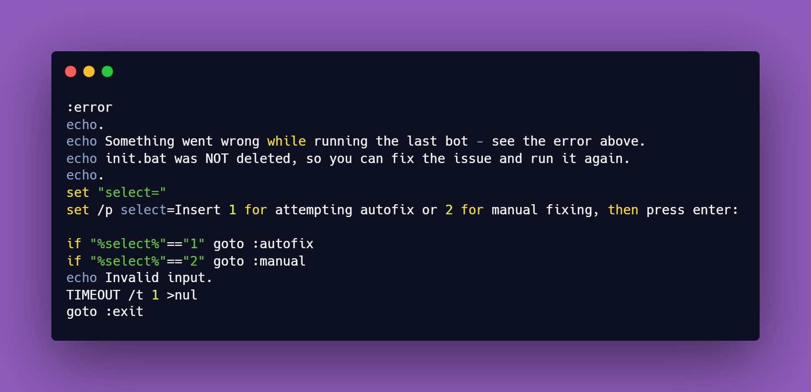

<h1>
  
  GDNewsBot
</h1>

<p>
  
  
  
</p>

GDNewsBot is a set of open-source Discord webhook bots.

# Usage

GDNewsBot is used in Discord servers for receiving Geometry Dash news and community content from Pointercrate, Dashword, and the r/GeometryDash subreddit.
It can be run via the `init.bat` file.

# Features

- **GD News Bot (DashWord)** — posts new articles of Dashword.net with title, description, and image, sorted by real publish date (not by page order, which isn't always reliable).
- **GD Reddit Bot** — posts new subreddit threads via Reddit's free RSS feed, with optional flair filtering (e.g. only "Discussion" posts, skipping memes and other fluff).
- **GD News Bot (Pointercrate)** — tracks the official Demon List and posts when a level enters the top 100 or changes position, complete with a video thumbnail.

## Customization

- Custom Role and Member pinging
- Custom Webhooks
- Flair Filtering for GD Reddit Bot [BETA]

<h1>
  
</h1>


# Setup

## Step 1

Clone the repo using the options below:

### Using Git

```bash
git clone https://github.com/FRANORDE/GDNewsBot.git
cd GDNewsBot
```

### Using GitHub

Click on the Code button, then download as ZIP

## Step 2

Copy the `env.example` content, create a new file, name it `.env` and paste the content copied in `env.example`. Fill in your credentials.

To get a webhook URL: open your Discord server, go to the channel you want the bot to post in → **Channel Settings → Integrations → Webhooks → New Webhook** → Create the Webhook and click on copy Webhook URL.
To use ping messages: go to `discord.com` and select continue in browser. Go to your user settings, scroll to "Developer" and select the toggle "Developer Mode". Then go to your server role, right click and select copy role ID. Wrap the copied ID like this: <@&ID>, replacing ID with the number you copied.e.

```env
DASHWORD_WEBHOOK_URL=https://discord.com/api/webhooks/...
DASHWORD_PING_MESSAGE=@everyone

REDDIT_WEBHOOK_URL=https://discord.com/api/webhooks/...
REDDIT_PING_MESSAGE=
REDDIT_USER_AGENT=GDNewsBot/1.0 (by /u/your-reddit-username)

POINTERCRATE_WEBHOOK_URL=https://discord.com/api/webhooks/...
POINTERCRATE_PING_MESSAGE=
```

You don't need to fill in every bot — only set up the webhooks for the sources you actually want to use. Leave a `_PING_MESSAGE` empty if you don't want that bot to ping anyone.

> **Never commit your real `.env` file** — it contains secrets. It's already listed in `.gitignore`, so a normal `git add .` won't pick it up.

## Step 3

Run `init.bat` — it checks that `.env` exists and runs each bot once to record its starting point (so you don't get flooded with old content on the first real run).
If a bot fails to start, `init.bat` will stop and show you the error instead of continuing — you'll get the option to auto-install missing libraries or fix things manually.

> **Manual alternative** (if you'd rather not use `init.bat`):
> ```bash
> pip install -r requirements.txt
> python "GD News Bot (DashWord).py"
> python "GD Reddit Bot.py"
> python "GD News Bot (Pointercrate).py"
> ```
